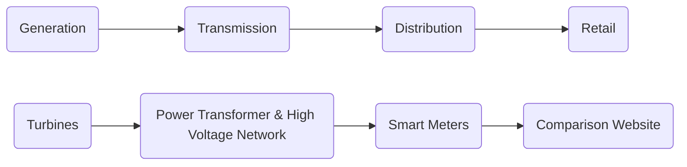
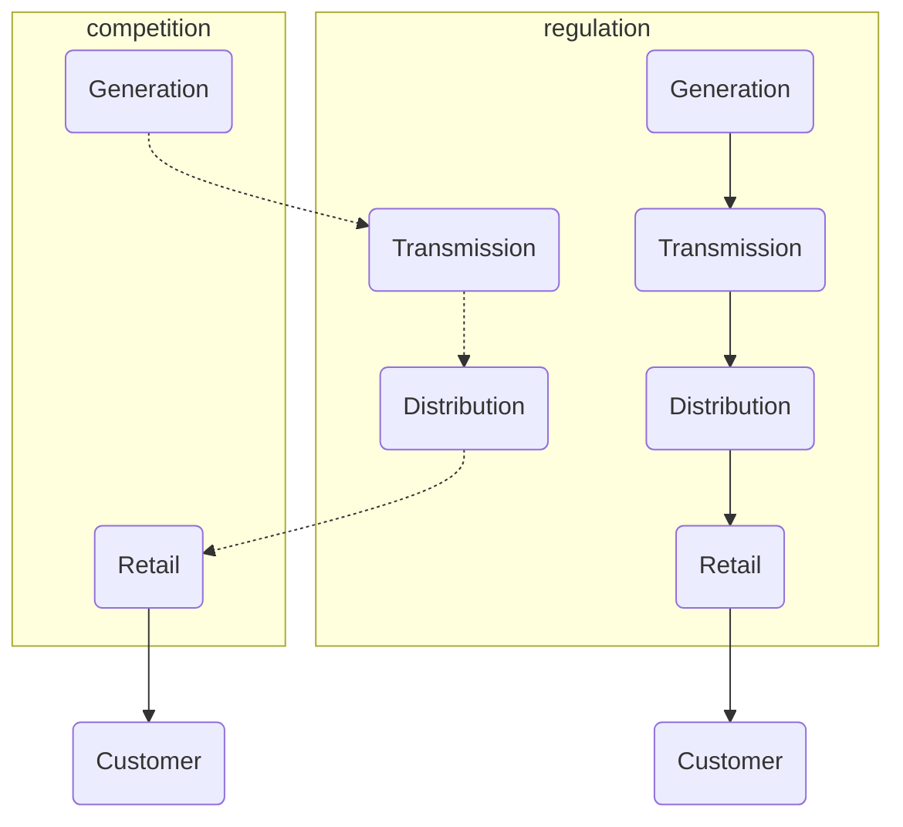
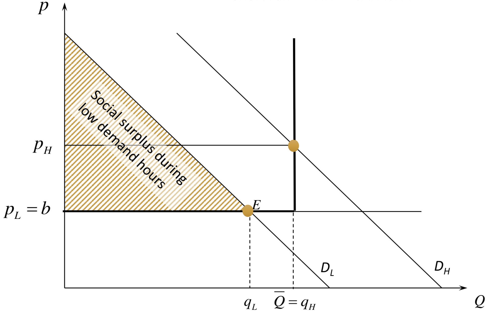
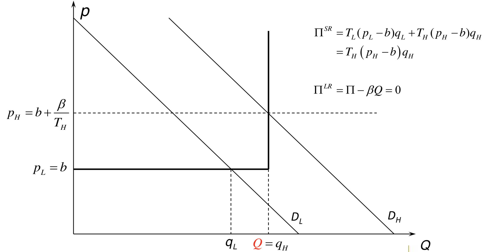
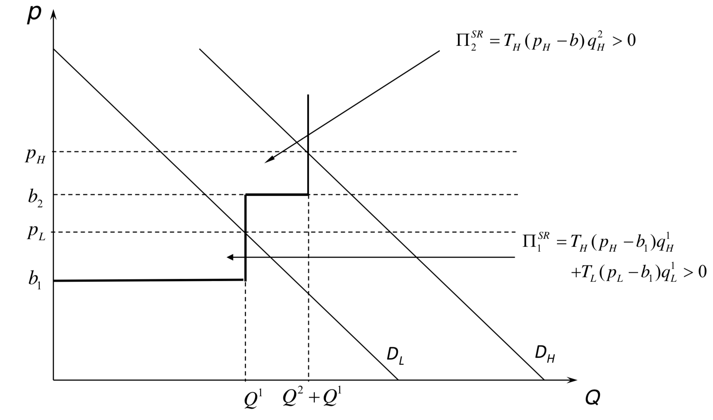
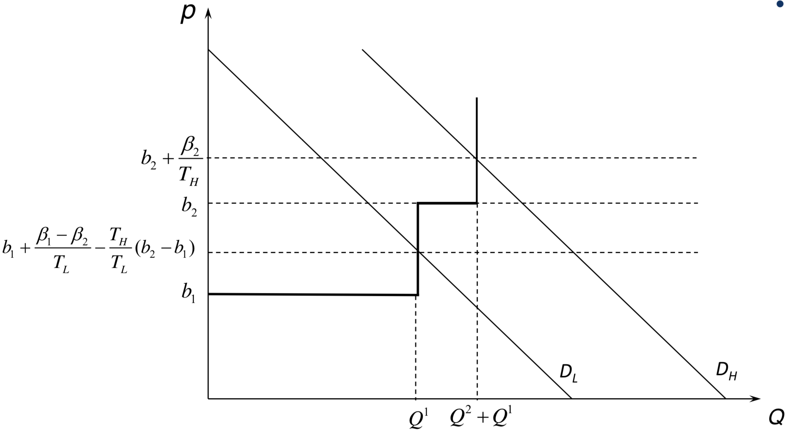

# Innovation and Networks Summary

## Network Industries

### Market architecture and Market structure

The **value chain** in the electricity market: 

- Economies of scale in generation
- Economies of scale in other activities (transmission, distribution, billing, metering)
- Economies of scope due to necessary coordination between different parts of the value chain

&rarr; Textbook example of a **natural monopoly**

Problems:

1. Market power
2. Cost recovery
3. Over-investment 

**Rethinking regulation:**

- 70s: Oil Crisis
- Mid 80s: technological changes &rarr; end of assumption of natural monopoly
- Mid 80s: liberalization &rarr; introduction of competition in generation and retail
- Vertical unbundling of regulated activities (distribution and transmission)
  - To ensure non-discrimination and enhance transparency

Investment regulation: heavy subsidization of renewable energy

**Market Structure: old versus new structure**

Characteristics of electricity markets

- Periodic demand
- Output cannot be stored
- Sufficient production capacity is needed

How to use existing capacity?

- Peak load pricing
  - Produce as long as $P>Short\ run\ MC$
  - Set price such that market clears

How to invest in capacity?

- Mixture of generation technologies
  - Base-load (High investment & Low short run MC)
  - Peak-load (Low investment & High short run MC)
- Enter as long as "short-term" profit = investment costs
  - Long term profit is zero (competition)

Implementation?

- This is the competitive market outcome!

#### One technology

<u>Short run equilibrium for market with only one technology</u>

- Capacity $(Q)$ = fixed
- 2 Periods $(i)$: low $(L)$ and high $(H)$ demand with duration $T_i$  
- Equilibrium if $p_i=MC \text{ and } q_i<Q$ 
- Equilbrium if $p_i>MC \text{ and } q_i=Q$ 

Social planner maximizes social welfare: 

$$\max\limits_{q_L,q_H}T_L\cdot(S_L(q_L)-b\cdot q_L)+T_H\cdot (S_H(q_H)-b\cdot q_H) \text{ , subject to }q_L\le \bar Q\ \&\ q_H\le\bar Q$$

The social planner prefers $p_L=b$ and $ p_H=b+\lambda_H$ (equal to perfect competition)

<u>Long run competitive equilibrium for market with one technology</u>

- Capacity is not fixed, what is the equilibrium investment level $(Q)$?
- Invest until long run profits are zero, that is $T_H(p_H-b)=\beta$ 
- Cost of investing in capacity $\beta$  

Social planner maximizes social welfare:

$$\max\limits_{q_L,q_H,Q}T_L\cdot(S_L(q_L)-b\cdot q_L)+T_H\cdot (S_H(q_H)-b\cdot q_H)-\beta Q \text{ , subject to }q_L\le Q\ \&\ q_H\le Q$$

The social planner prefers $p_L=b$ and $p_H=b+\frac{\beta}{T_H}$ (equal to perfect competition) 

<u>Average cost pricing</u>

- Too much consumption in peak hours
- Too little consumption in off-peak hours

&rarr; Dead weight loss

#### Multiple technologies: Peak-Load Pricing

The competitive market will lead to the ideal generation mix, investments for every technology are such that their expected long term profit is zero. 

<u>Short run equilibrium</u>

Short run profit is obtained for each technology

<u>Long run equilibrium</u>

Free entry for each technology, long run profit of each technology equal to zero.

- Higher prices during peak hours
- Lower prices in base hours
- Generators make short run operational profit 
- Short run profit collected during high demand: risky profit stream
- Profit is used to cover investment costs
- Peak load pricing leads to optimal production mix (base and peak load)

#### Reserve markets and rolling blackouts

- Stochastic demand and supply
- Plants can break down
- Slow adjustment
- Consumers do not react quickly to price changes

&rarr; Risk for system black-out &rarr; need for plants to be standby, which is costly

How much reserve?

- Tradeoff
  - Cost of providing reserve power
  - Risk of system black out

$$\max\limits_{Reserve Margin}\Pr(Blackout|Reserve Margin)\cdot Cost Blackout - C(Reserve Margin)$$

**Optimal market design: two parallel markets**

- Spot market: buyers and sellers meet to buy electricity
- Reserve market: network operator buys reserve power from generators
- Rolling blackouts: network operators contract consumers to reduce consumption as needed, or create rolling blackouts
- *Cost of reserves is added to the wholesale price*

#### Centralized vs. Decentralized organization

Until now:

- Perfectly competitive market will lead to efficient production and investment decisions in a **decentralized** manner <u>if prices correspond to scarcity of power</u>

However:

- Debate about degree of of central coordination and whether the market will deliver

Power Pool (centralized): better coordination

Power Exchanges (decentralized): better incentives

#### Market operations in practice

- Day-ahead (spot) markets: wholesale power exchanges
  - Producers and consumers bid supply and demand to match needs over the following day &rarr; market clearing
  - Markets can be coupled with neighboring regions
  - Volatile and risky &rarr; risk hedging by financial markets and forward contract exchanges
- Forward and option markets
  - Month, quarter and year contracts
  - Base and peak contracts
- Balancing market
  - To adapt to short run fluctuations (no storage possible)
  - To make sure dispatch is consistent with transmission constraints
  - Centrally organized, operated by system operator
  - Prices per 15 minutes 
  - Very volatile
- Reserve markets
  - Some markets: obligation for firms to schedule reserves
  - Other markets: centralized procurement of reserves

### Market Power

- Electricity = **homogeneous** good
- Firms submit **price bids** in power exchange

Prediction: **Bertrand** competition is a good representation of electricity markets &rarr; two firms sufficient for perfectly competitive outcome

- Data shows: 2 firms insufficient for competition (20% markup)

What is wrong with the prediction? 

- Energy cannot be stored easily
- Energy needs to be produced when demand occurs
- &rarr; Capacity contraints matter
- &rarr; Very inelastic short run demand

